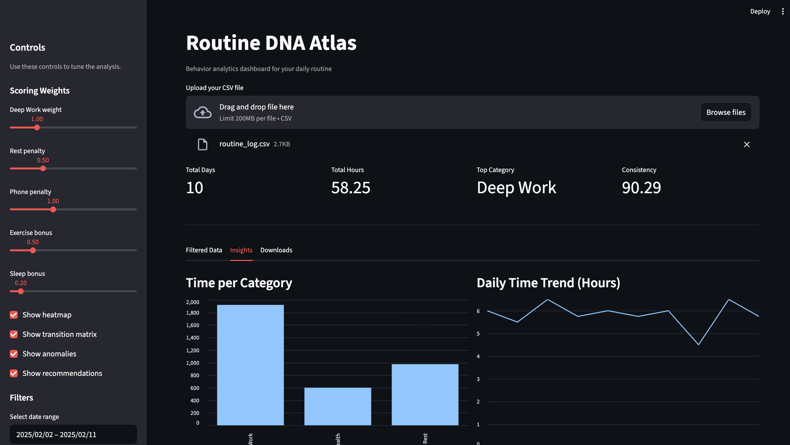
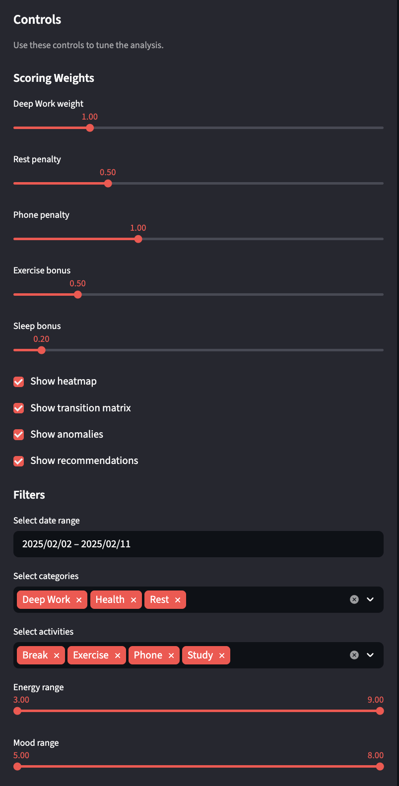
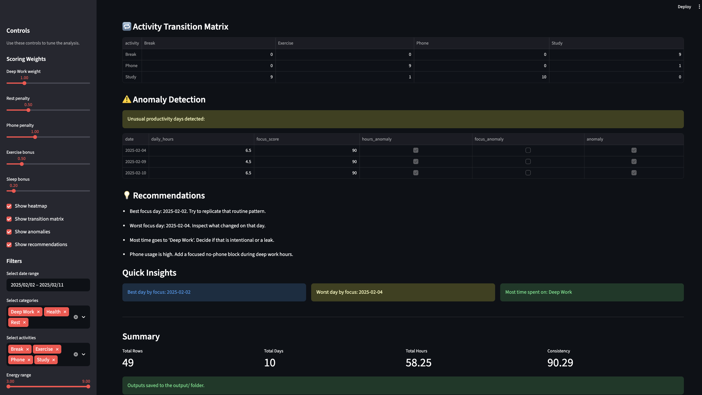
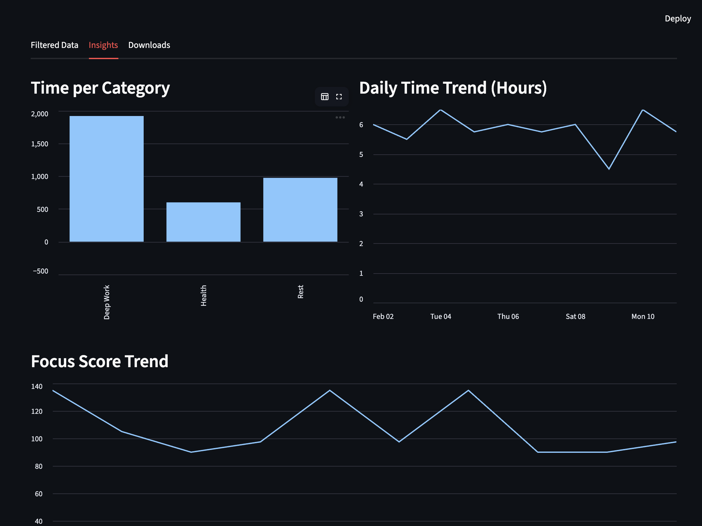
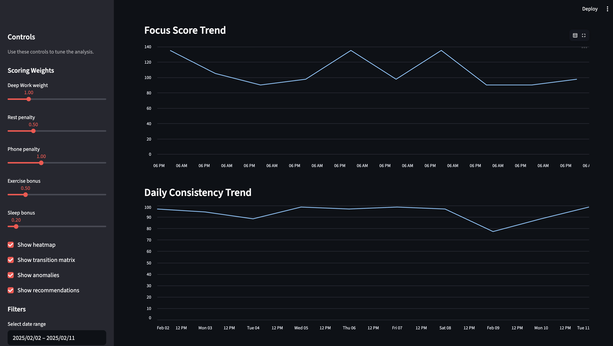
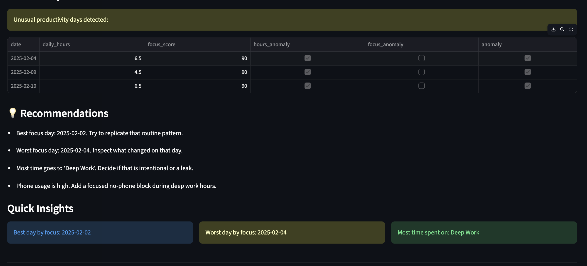

<p align="center">
  
</p>

<h1 align="center">Routine DNA Atlas</h1>

<p align="center">
Behavior Analytics • Productivity Intelligence • Focus Tracking
</p>

Routine DNA Atlas is a Python-powered routine intelligence dashboard that turns daily activity logs into structured insights. It helps users understand how their time is distributed, where focus is strongest, where distraction appears, and how consistent their routine really is.

Built with **Streamlit**, **Pandas**, **NumPy**, and **Matplotlib**, the project transforms a simple CSV file into a visual productivity profile with scoring, trend analysis, anomaly detection, and actionable recommendations.

---

## What the Project Does

Routine DNA Atlas reads routine data from a CSV file and performs a full analysis pipeline:

- calculates time spent on each activity category
- measures daily productivity trends
- builds a custom focus score
- detects unusual routine days
- evaluates consistency across days
- generates visual dashboards and downloadable summaries

The goal is not just to display data, but to interpret behavior.

---

## Why This Project Stands Out

Most routine trackers only store logs.  
This project goes further by turning logs into a **behavioral fingerprint**.

It combines:
- **analysis**
- **visualization**
- **scoring**
- **classification**
- **recommendation logic**

That makes it useful for students, self-trackers, productivity enthusiasts, and anyone who wants to understand their daily rhythm more deeply.

---

## Visual Feature Tour

Routine DNA Atlas is structured like an analytics workflow, not a static dashboard. Each screen reveals a different layer of the routine intelligence pipeline — from raw activity logs to interpreted insights and export-ready summaries.

### 1. Command Center
The landing view gives a high-level snapshot of the routine dataset. It surfaces the most important metrics immediately: total days logged, total hours tracked, the leading category by time, and overall consistency.



### 2. Control Lab
This panel turns the dashboard into an interactive analysis tool. Users can filter by date, category, activity, energy, and mood, while also tuning the scoring weights that shape the interpretation of the data.



### 3. Data Lens
This section shows the cleaned and filtered dataset after validation. It is the checkpoint that confirms the CSV has been parsed correctly and that the analysis is running on structured data.


### 4. Performance Signals
This view highlights the core metrics behind the routine. It presents category-level time distribution and daily activity patterns so users can quickly spot imbalance, overload, or missing structure.



### 5. Rhythm Curves
This analytics layer visualizes behavioral momentum across the routine timeline. It tracks category-wise time allocation, daily productivity variation, and focus score movement to reveal hidden performance patterns and routine stability.






### 6. Productivity Engine
This is the analytical core of the app. It combines the custom productivity score with deeper routine interpretation, turning raw logs into a behavioral profile rather than just a set of charts.


### 7. Anomaly Detection & Recommendation Engine

This subsystem continuously evaluates behavioral irregularities across the productivity timeline and identifies patterns that may negatively impact routine stability.

The engine combines anomaly detection logic with insight generation to surface:
- Productivity inconsistencies
- Deep-work disruptions
- High-distraction periods
- Behavioral efficiency drops
- Actionable optimization recommendations

The recommendation layer transforms analytical observations into interpretable productivity guidance, enabling users to refine routine structure and improve consistency over time.



### 8. Export Hub
The final section presents the computed summaries in a table-first format. It includes category summaries, daily hours, focus scores, and consistency scores, making the results easy to reuse or export.


## How the Dashboard Works

The system follows a clear analytical pipeline:

**Upload Data → Validate & Clean → Filter → Score → Detect Patterns → Generate Insights → Export Results**

This flow makes Routine DNA Atlas feel like a real analytics product rather than a standalone script.

---

## Tech Stack

- **Python**
- **Streamlit**
- **Pandas**
- **NumPy**
- **Matplotlib**

---

## Project Structure

```text
routine-dna-atlas/
├── app.py
├── analysis.py
├── requirements.txt
├── .gitignore
├── data/
│   └── routine_log.csv
└── README.md
