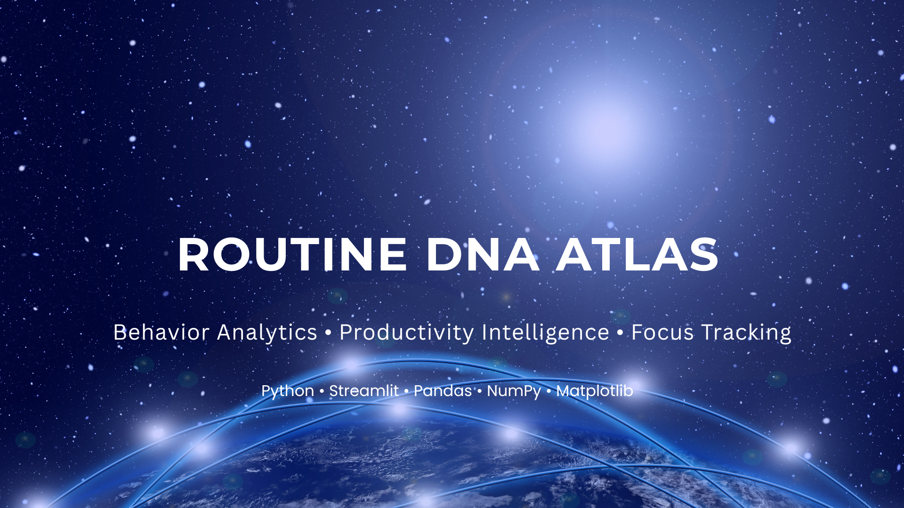

<p align="center">
  
</p>

<h1 align="center">Routine DNA Atlas</h1>

<p align="center">
Behavior Analytics • Productivity Intelligence • Focus Tracking
</p>

Routine DNA Atlas is a Python-powered routine intelligence dashboard that turns daily activity logs into structured insights. It helps users understand how their time is distributed, where focus is strongest, where distraction appears, and how consistent their routine really is.

Built with **Streamlit**, **Pandas**, **NumPy**, and **Matplotlib**, the project transforms a simple CSV file into a visual productivity profile with scoring, trend analysis, anomaly detection, and actionable recommendations.

---

## What the Project Does

Routine DNA Atlas reads routine data from a CSV file and performs a full analysis pipeline:

- calculates time spent on each activity category
- measures daily productivity trends
- builds a custom focus score
- detects unusual routine days
- evaluates consistency across days
- generates visual dashboards and downloadable summaries

The goal is not just to display data, but to interpret behavior.

---

## Why This Project Stands Out

Most routine trackers only store logs.  
This project goes further by turning logs into a **behavioral fingerprint**.

It combines:
- **analysis**
- **visualization**
- **scoring**
- **classification**
- **recommendation logic**

That makes it useful for students, self-trackers, productivity enthusiasts, and anyone who wants to understand their daily rhythm more deeply.

---

## Features

- CSV upload-based routine analysis
- Data validation and cleaning
- Category-wise time breakdown
- Daily time trend visualization
- Custom focus score calculation
- Consistency score across days
- Weekday vs hour heatmap
- Activity transition matrix
- Anomaly detection using IQR
- Personalized recommendations
- CSV export and download support
- Interactive Streamlit dashboard

---

## Tech Stack

- **Python**
- **Streamlit**
- **Pandas**
- **NumPy**
- **Matplotlib**

---

## Project Structure

```text
routine-dna-atlas/
├── app.py
├── analysis.py
├── requirements.txt
├── .gitignore
├── data/
│   └── routine_log.csv
└── README.md
